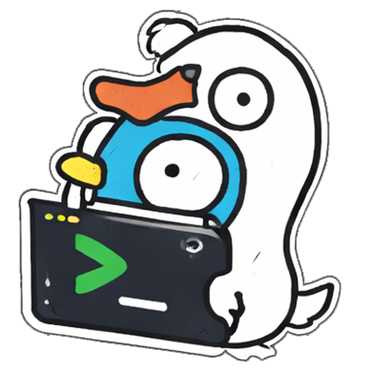

# cli



[](https://pkg.go.dev/github.com/pressly/cli#pkg-index)
[](https://github.com/pressly/cli/actions/workflows/ci.yaml)

An intentionally minimal Go package for building CLI applications. Extends the standard library's
`flag` package to support [flags
anywhere](https://mfridman.com/blog/2024/allowing-flags-anywhere-on-the-cli/) in command arguments,
adds nested subcommands, and gets out of the way.

## Installation

```bash
go get github.com/pressly/cli@latest
```

Requires Go 1.21 or higher.

## Quick Start

```go
root := &cli.Command{
	Name:      "greet",
	ShortHelp: "Print a greeting",
	Exec: func(ctx context.Context, s *cli.State) error {
		fmt.Fprintln(s.Stdout, "hello, world!")
		return nil
	},
}
if err := cli.ParseAndRun(ctx, root, os.Args[1:], nil); err != nil {
	fmt.Fprintf(os.Stderr, "error: %v\n", err)
	os.Exit(1)
}
```

`ParseAndRun` parses the command hierarchy, handles `--help` automatically, and executes the
resolved command. For applications that need work between parsing and execution, use `Parse` and
`Run` separately. See the [examples](examples/) directory for more complete applications.

## Flags

`FlagsFunc` is a convenience for defining flags inline. Use `FlagOptions` to extend the standard
`flag` package with features like required flag enforcement and short aliases:

```go
Flags: cli.FlagsFunc(func(f *flag.FlagSet) {
	f.Bool("verbose", false, "enable verbose output")
	f.String("output", "", "output file")
}),
FlagOptions: []cli.FlagOption{
	{Name: "verbose", Short: "v"},
	{Name: "output", Short: "o", Required: true},
},
```

Short aliases register `-v` as an alias for `--verbose`, `-o` as an alias for `--output`, and so on.
Both forms are shown in help output automatically.

Access flags inside `Exec` with the type-safe `GetFlag` function:

```go
verbose := cli.GetFlag[bool](s, "verbose")
output := cli.GetFlag[string](s, "output")
```

Child commands automatically inherit flags from parent commands, so a `--verbose` flag on the root
is accessible from any subcommand via `GetFlag`.

## Subcommands

Commands can have nested subcommands, each with their own flags and `Exec` function:

```go
root := &cli.Command{
	Name:      "todo",
	Usage:     "todo <command> [flags]",
	ShortHelp: "A simple CLI for managing your tasks",
	SubCommands: []*cli.Command{
		{
			Name:      "list",
			ShortHelp: "List all tasks",
			Exec: func(ctx context.Context, s *cli.State) error {
				// ...
				return nil
			},
		},
	},
}
```

For a more complete example with deeply nested subcommands, see the [todo
example](examples/cmd/task/).

## Help

Help text is generated automatically and displayed when `--help` is passed. To customize it, set the
`UsageFunc` field on a command.

## Usage Syntax

See [docs/usage-syntax.md](docs/usage-syntax.md) for conventions used in usage strings.

## Status

This project is in active development and undergoing changes as the API gets refined. Please open an
issue if you encounter any problems or have suggestions for improvement.

## Acknowledgements

There are many great CLI libraries out there, but I always felt [they were too heavy for my
needs](https://mfridman.com/blog/2021/a-simpler-building-block-for-go-clis/).

Inspired by Peter Bourgon's [ff](https://github.com/peterbourgon/ff) library, specifically the `v3`
branch, which was so close to what I wanted. The `v4` branch took a different direction, and I
wanted to keep the simplicity of `v3`. This library carries that idea forward.

## License

This project is licensed under the MIT License - see the [LICENSE](LICENSE) file for details.
