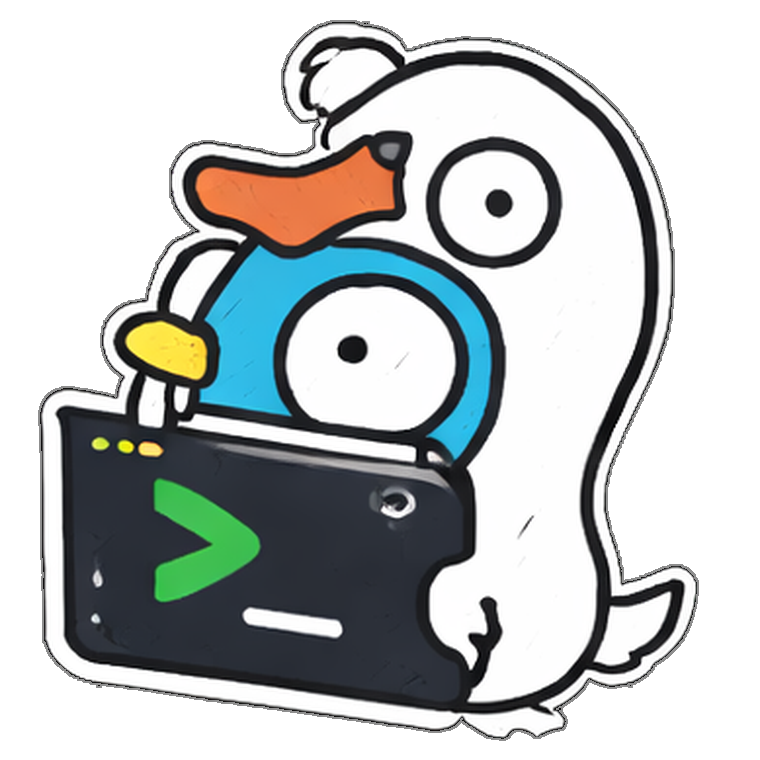

# cli



[](https://pkg.go.dev/github.com/pressly/cli#pkg-index)
[](https://github.com/pressly/cli/actions/workflows/ci.yaml)
[](https://pressly.github.io/cli)

An intentionally minimal Go package for building CLI applications. It extends the standard library's
`flag` package with nested subcommands and [flags
anywhere](https://mfridman.com/blog/2024/allowing-flags-anywhere-on-the-cli/), then gets out of the
way.

Docs: <https://pressly.github.io/cli>

## Installation

```bash
go get github.com/pressly/cli@latest
```

Requires Go 1.27 or higher.

## Quick Start

```go
root := &cli.Command{
	Name:  "echo",
	Usage: "echo [flags] <text>...",
	Flags: cli.FlagsFunc(func(f *flag.FlagSet) {
		f.Bool("capitalize", false, "capitalize the input")
	}),
	Exec: func(ctx context.Context, s *cli.State) error {
		text := strings.Join(s.Args, " ")
		// GetFlag uses generic methods, available in Go 1.27.
		if s.GetFlag[bool]("capitalize") {
			text = strings.ToUpper(text)
		}
		fmt.Fprintln(s.Stdout, text)
		return nil
	},
}
if err := cli.ParseAndRun(ctx, root, os.Args[1:], nil); err != nil {
	fmt.Fprintf(os.Stderr, "error: %v\n", err)
	os.Exit(1)
}
```

`ParseAndRun` parses the command hierarchy, handles `--help`, and runs the selected command.

The command above gets usable help without extra setup:

```text
Usage:
  echo [flags] <text>...

Flags:
  --capitalize    capitalize the input
```

For subcommands, inherited, local, and required flags, custom help, usage errors, and subpackages,
see the [documentation](https://pressly.github.io/cli). More complete programs live in
[examples](examples/).

## Acknowledgements

There are many great CLI libraries out there, but I always felt [they were too heavy for my
needs](https://mfridman.com/blog/2021/a-simpler-building-block-for-go-clis/).

Inspired by Peter Bourgon's [ff](https://github.com/peterbourgon/ff) library, especially its `v3`
branch, which was close to what I wanted. `v4` took a different direction, but I wanted to keep the
simplicity of `v3`. This library carries that idea forward.

## License

This project is licensed under the MIT License - see the [LICENSE](LICENSE) file for details.
